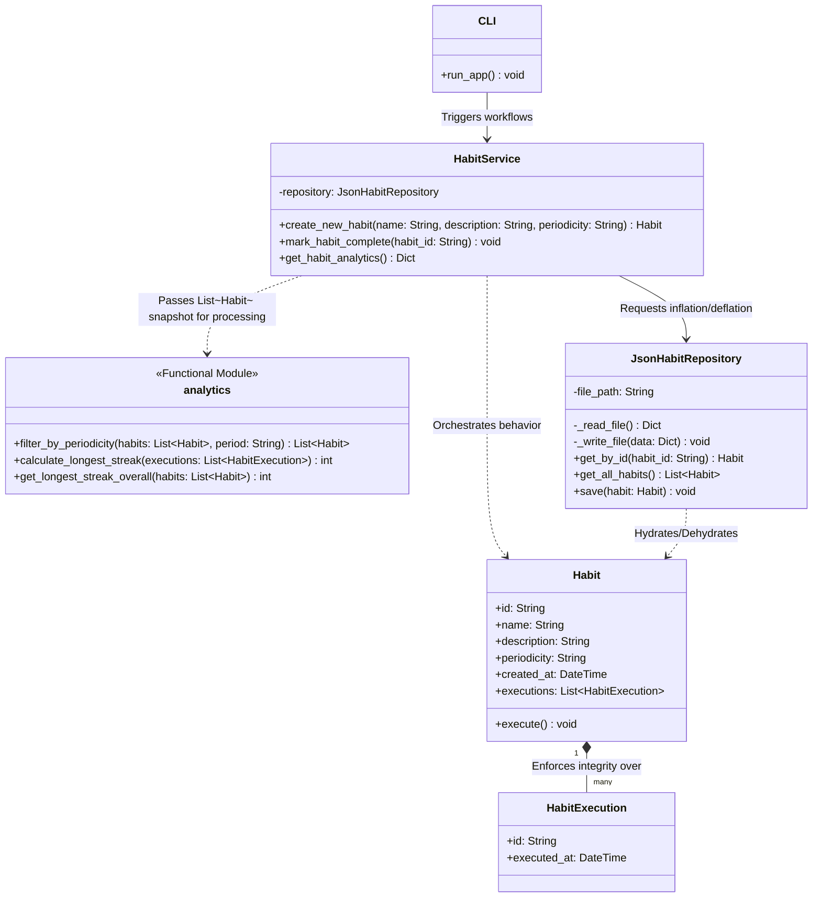
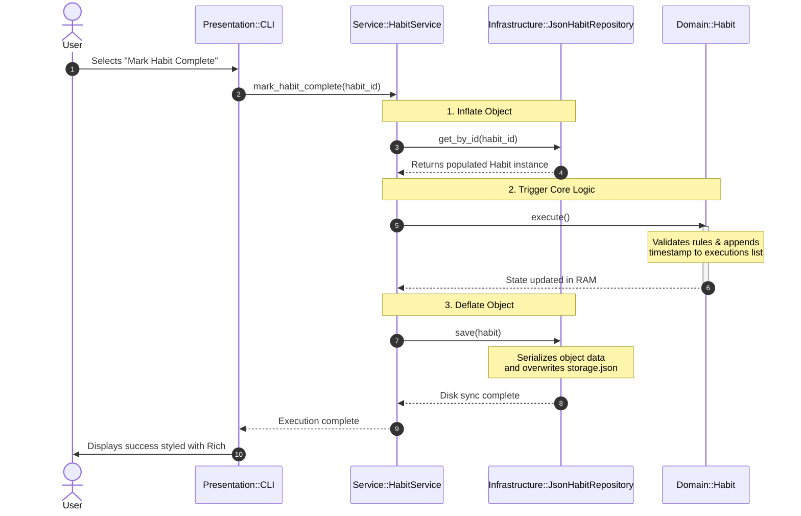

# Technical Concept: Hábito Habit Tracker

# Intro
As part of the course DLBDSOOFPP01, the task to create a habit tracker is given. In phase 1, the object is to create a technical concept of the program and hand it in.
This document is the technical concept for Phase 1.

# Pitch
Imagine working an interesting, challenging job. Every day you give your very best, yet still in the evenings you feel somewhat tired and exhausted. You think, it is just the stress, it will go away. 

After some weeks, you figure you are not going to sports anymore, and rarely you take the time to meditate.

You will do it tomorrow.

Another tomorrow, and still, nothing. Feels like you just did it yesterday, but also feels like you never gonna do it again.

Wouldn't it be great, if you could keep track of your habits? Visualizing behaviour can be a first step into recognizing patterns and think of actionable items.

This is where *Hábito*, your personal habit tracker, is coming to play. Supporting to log your habits, whether they are daily or weekly. But it is not only logging of course, to give you the extra push of motivation, you can also track your streaks. And for the inner monk, you can access all your data via the analytics module to see patterns.

# Technical concept
## Implementation constraints
The course is called 'Object Oriented and Functional Programming with Python' and as such the implementation needs to be based on modern Python. Also the version is specified to be `>=3.7`.

## Acceptance Criteria
- comprehensive documentation
    - installation instruction
    - run instruction
    - test execution instructions
- usage of Python docstrings
- usage of Python class(es) for the implementation
- supporting at least weekly and daily habits
- ship with demo data 
    - containing 5 predefined habits
    - example tracking data for past 4 weeks
- timestamps for habit creation and completion
- data persistence
- analytics module (using functional paradigm)
    - list of all currently tracked habits
    - list of all habits with the same periodicity
    - longest run streak of all defined habits
    - longest run streak for a specific habit
- a user interface that users understand
- unit test suite 

# Design consideration
## User perspective
As a user, I don't want stuff to get in my way. Since *In the Beginning there was Command Line* [^1] of course the true beauty of a tool can be expressed on the CLI only.

## Technical
Following the users desire of an easy to use, always on solution, these decisions need to be made:

### User interface
Pure input loop is maybe a bit too little for the brave command line warrior, we will use the `Rich` package to support rich CLI.

### Multi device support
*Everything is a file* is a common design pattern in UNIX-like systems. We should follow the same pattern and use plain json files as storages. This will enable us to git them and easily work with them. It will also protect the users from a tool lock-in.

# Technical Design
## System Architecture & Class Diagram
The following diagram outlines the structural boundaries of Hábito. While the core data mutations and lifecycle operations are strictly managed using Object-Oriented principles, the analytics module is isolated as a stateless, pure functional layer to fulfill the functional programming criteria without introducing side effects to the domain models.

## Architectural Justification
The application implements a strict three-layer architecture to maximize separation of concerns. By isolating the user interface (Presentation), business rules (Domain), and data access (Infrastructure), the system achieves three core engineering goals:
1. High Testability: Isolating pure domain operations ensures that critical tracking components can be rigorously verified via unit tests without file-system dependencies.
2. Infrastructure Decoupling (Swapability): By utilizing the Repository Pattern, the core domain remains entirely oblivious to data persistence mechanisms. This allows the data backend to be seamlessly upgraded from a flat JSON file to a relational database (e.g., SQLite3) without altering business logic.
3. Presentation Extensibility: Separating the CLI layer ensures that alternative entry points, such as a Flask-based REST API, can be attached in the future without modifying the underlying application workflows.

## Tool Justification
To implement the proposed architecture efficiently and meet all acceptance criteria, the following libraries and built-in modules have been selected:  

* Python json Module (Persistence): To satisfy the requirement for data persistence , a file-based JSON storage mechanism is utilized via Python’s built-in json module. This format provides an interchangeable, human-readable, and machine-readable data snapshot that prevents platform lock-in and allows seamless inspection of data fixtures.
* Rich Library (Presentation Layer): To fulfill the demand for an intuitive command line interface, the third-party Rich package will be leveraged. Rich abstracts terminal rendering complexities, enabling the delivery of a clean, structured interface featuring stylized menus and data tables without polluting the presentation logic with low-level console formatting.
* Python datetime Module (Domain Logic): Accurate timestamping of habit creation and execution is mandated by the project specifications. The datetime module is essential for converting string-based timestamps into rich temporal objects in RAM. This allows the domain layer to reliably compute complex calendar mathematics, such as consecutive-period tracking and streak boundaries, without manually accounting for calendar irregularities like leap years or varying month lengths.

## Application Process & User Flow
The execution flow of Hábito follows a strict linear path downward through the architectural layers to guarantee data isolation and predictability:
- **Interaction (Presentation Layer):** The user selects an option from the Rich command line interface menu, such as marking a habit as complete.
- **Orchestration (Service Layer):** The CLI invokes the HabitService controller. The service acts as the orchestrator; it coordinates with the JsonHabitRepository to locate the habit data on the disk and "inflate" it into a living Python object in memory.
- **Validation & State Change (Domain Layer):** The service delegates the execution to the Habit entity by calling .execute(). The entity evaluates internal business logic rules (e.g., preventing duplicate check-offs within the same period) and alters its internal executions collection.
- **Persistence (Infrastructure Layer):** Once the domain entity successfully mutates its state in RAM, the service passes the updated object back to the JsonHabitRepository. The repository serializes ("deflates") the entity state back into raw JSON data and flushes it to the storage file on disk.
- **Feedback Loop:** The service completes its routine and signals success back to the CLI, which prints a stylized confirmation message to the user.

# Footnotes and Sources
[^1]: Stephenson, N. (1999). In the beginning ... was the command line. Avon Books.
